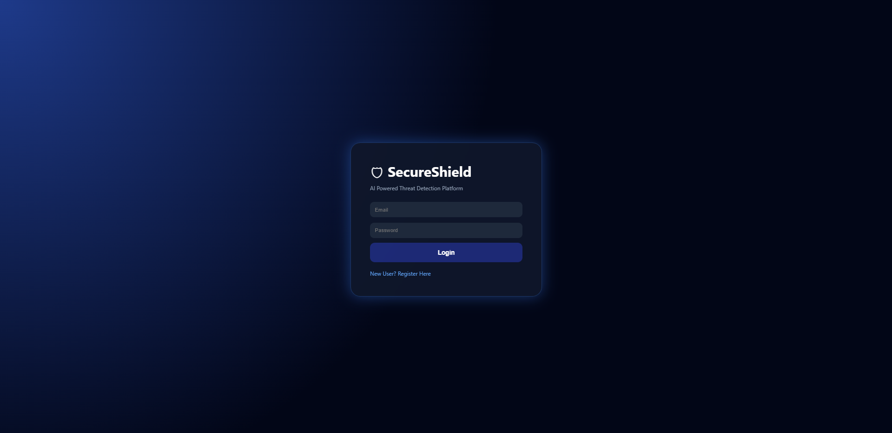
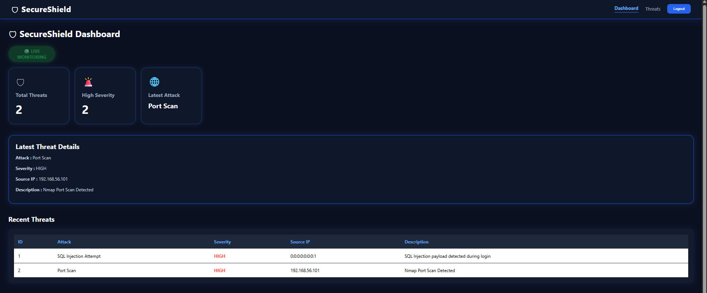
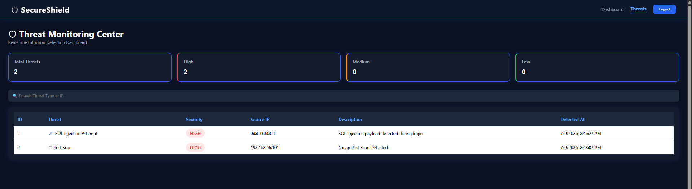

# 🛡️ Secure Shield

<p align="center">
  <strong>A Full-Stack Cybersecurity Threat Detection & Monitoring Platform</strong>
</p>

<p align="center">

Securely detect, monitor, and manage cybersecurity threats through a centralized dashboard powered by Spring Boot, React, and real-time network packet analysis.

</p>

<p align="center">


</p>
---

## 📖 Overview

Secure Shield is a full-stack cybersecurity threat detection and monitoring platform designed to simulate core Security Operations Center (SOC) workflows. The application provides secure authentication, rule-based threat detection, audit logging, and a centralized dashboard for monitoring and managing security events.

Built using Spring Boot and React, the project demonstrates secure backend development practices, RESTful API design, and modern frontend integration while emphasizing scalability, maintainability, and clean architecture.

---

## ✨ Key Features

* 🔐 Secure user registration and authentication using JWT
* 🛡️ Spring Security-based authorization
* 🚨 Rule-based threat detection engine
* 🌐 Port Scan Detection
* 💉 SQL Injection Detection
* 📦 Packet Analysis Module
* 📊 Threat Management Dashboard
* 📜 Audit Logging
* ⚠️ Threat Severity Classification
* 🔍 RESTful API Architecture
* 💻 Responsive React User Interface

---

## 🏗️ Architecture

```text
                        React Frontend
                              │
                        Axios REST Client
                              │
                     Spring Boot REST API
                              │
      ┌──────────────┬──────────────┬──────────────┐
      │              │              │
 Authentication   Threat Engine   Audit Logging
      │              │              │
      └──────────────┴──────────────┘
                     PostgreSQL Database
```

---

## 🛠️ Technology Stack

| Layer               | Technologies                                                      |
| ------------------- | ----------------------------------------------------------------- |
| **Backend**         | Java 17, Spring Boot, Spring Security, Spring Data JPA, Hibernate |
| **Frontend**        | React, JavaScript, HTML5, CSS3, Axios                             |
| **Database**        | PostgreSQL                                                        |
| **Authentication**  | JSON Web Token (JWT)                                              |
| **Build Tool**      | Maven                                                             |
| **API Testing**     | Postman                                                           |
| **Version Control** | Git & GitHub                                                      |

---

## 📸 Application Preview

> Replace the placeholders below with actual screenshots of your application.

|            Login           |            Dashboard           |
| :------------------------: | :----------------------------: |
|  |  |

|       Threat Management      |  
| :--------------------------: | 
|  

---

## 📂 Project Structure

```text
Secure-Shield
│
├── secure-shield-backend
│   ├── config
│   ├── controller
│   ├── detection
│   ├── dto
│   ├── entity
│   ├── repository
│   ├── security
│   ├── service
│   └── util
│
├── Secure-Shield-Frontend
│   └── frontend
│       ├── public
│       ├── src
│       │   ├── components
│       │   ├── pages
│       │   ├── services
│       │   ├── styles
│       │   └── api
│
├── screenshots
│
└── README.md
```

---

## 🚀 Getting Started

### Clone the Repository

```bash
git clone https://github.com/your-username/Secure-Shield.git
cd Secure-Shield
```

### Backend Setup

```bash
cd secure-shield-backend
```

Configure your PostgreSQL database credentials inside:

```properties
src/main/resources/application.properties
```

Run the backend:

```bash
./mvnw spring-boot:run
```

---

### Frontend Setup

```bash
cd Secure-Shield-Frontend/frontend

npm install

npm start
```

---

## 📡 REST API

| Method | Endpoint         | Description                        |
| ------ | ---------------- | ---------------------------------- |
| POST   | `/auth/register` | Register a new user                |
| POST   | `/auth/login`    | Authenticate user and generate JWT |
| GET    | `/threats`       | Retrieve all threats               |
| POST   | `/threats`       | Create a threat record             |
| GET    | `/audit-logs`    | Retrieve audit logs                |

---

## 📌 Future Enhancements

* 📈 Interactive Threat Analytics Dashboard
* 🌍 Network Traffic Visualization
* 📍 Threat Geolocation Mapping
* 🔎 Advanced Filtering & Search
* 📤 Report Export (PDF/CSV)
* 📧 Email Notification System

---

## 👨‍💻 Author

**Sujeth S**

Java Backend Developer • Full-Stack Developer • Cybersecurity Enthusiast

* 💼 Passionate about building secure, scalable backend applications.
* 🌱 Currently exploring cybersecurity, network security, and secure software engineering.

---

<p align="center">
⭐ If you found this project interesting, consider giving it a star.
</p>
